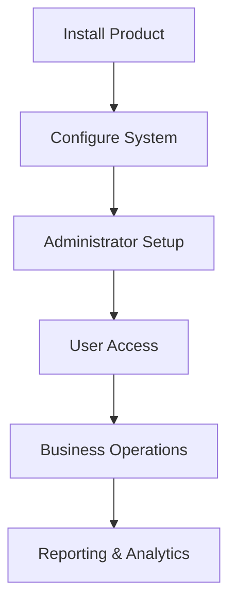
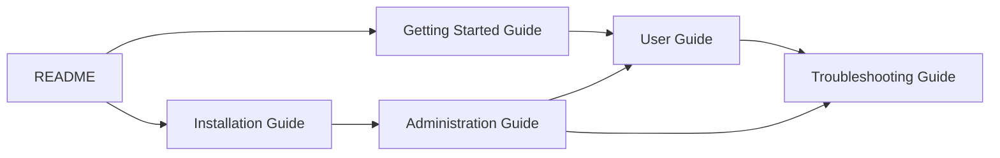

# docs-as-code-training
# 🚀 XYZ Product

> Modern Enterprise Management Platform

[](./docs/CHANGELOG.md)


XYZ Product is a modern enterprise platform designed to streamline employee management, payroll integration, reporting, administration, and business operations.

### Key Benefits

✅ Easy Installation

✅ Secure Administration

✅ Powerful Reporting

✅ Enterprise Scalability

✅ REST API Integration

✅ Modern User Experience

---

## Product Overview



---

## Product Screenshot


> Sample Installation Wizard screen shown above.

---

# 📚 Documentation Center

The following guides are available to help you successfully deploy and operate XYZ Product.

---

<table>
<tr>
<td width="50%">

## 🛠 Installation Guide

**Purpose**

Learn how to install and validate XYZ Product.

### Topics Covered

- System Requirements
- Software Installation
- Configuration
- Validation
- Upgrade Preparation

### Quick Link

➡️ [Installation Guide](/docs/installation.mdwidth="50%">)

### When To Use

✅ New Deployment

✅ Product Upgrade

✅ Environment Rebuild

### Typical Audience

- System Administrators
- Infrastructure Teams
- IT Support Staff

</td>
</tr>
</table>

---

<table>
<tr>
<td width="50%">

## 🚀 Getting Started Guide

**Purpose**

Get new users productive quickly.

### Topics Covered

- First Login
- Initial Configuration
- Basic Navigation
- Creating Records
- Running Reports

### Quick Link

➡️ guides/GettingStartedGuide.md

</td>

<td width="50%">

### When To Use

✅ New User Onboarding

✅ Product Evaluation

✅ Training Programs

### Typical Audience

- Business Users
- Managers
- Department Leads

</td>
</tr>
</table>

---

<table>
<tr>
<td width="50%">

## 🔐 Administration Guide

**Purpose**

Manage users, permissions, security, and integrations.

### Topics Covered

- User Management
- Security Configuration
- Role Assignment
- SSO Setup
- Auditing

### Quick Link

➡️ guides/AdministrationGuide.md

</td>

<td width="50%">

### When To Use

✅ User Provisioning

✅ Security Reviews

✅ Compliance Audits

✅ System Configuration

### Typical Audience

- Administrators
- Security Teams
- IT Operations

</td>
</tr>
</table>

---

<table>
<tr>
<td width="50%">

## 👤 User Guide

**Purpose**

Help end users perform daily activities.

### Topics Covered

- Dashboard Navigation
- Data Entry
- Searching Records
- Reporting
- Preferences

### Quick Link

➡️ guides/UserGuide.md

</td>

<td width="50%">

### When To Use

✅ Daily Operations

✅ Learning New Features

✅ Business Processes

### Typical Audience

- End Users
- Managers
- HR Personnel

</td>
</tr>
</table>

---

<table>
<tr>
<td width="50%">

## 🛟 Troubleshooting Guide

**Purpose**

Resolve common operational issues.

### Topics Covered

- Login Failures
- Permission Issues
- Integration Problems
- Error Codes
- Log Collection

### Quick Link

➡️ guides/TroubleshootingGuide.md

</td>

<td width="50%">

### When To Use

✅ Error Resolution

✅ Support Investigations

✅ Escalation Activities

### Typical Audience

- Support Engineers
- Administrators
- Power Users

</td>
</tr>
</table>

---

# 🗺 Documentation Navigation Map



---

# 📋 Recommended Reading Path

| Scenario | Recommended Guide |
|-----------|------------------|
| New Installation | Installation Guide |
| First Time User | Getting Started Guide |
| Daily Operations | User Guide |
| Manage Security & Users | Administration Guide |
| Resolve Errors | Troubleshooting Guide |

---

# 🔄 Common Workflows

## New Customer Deployment

```text
README
└── Installation Guide
└── Administration Guide
└── Getting Started Guide
└── User Guide
```

---

## Support Investigation

```text
README
└── Troubleshooting Guide
└── Administration Guide
└── User Guide
```

---

# 📂 Documentation Structure

```text
docs/

├── README.md
│
├── guides/
│ ├── InstallationGuide.md
│ ├── GettingStartedGuide.md
│ ├── AdministrationGuide.md
│ ├── UserGuide.md
│ └── TroubleshootingGuide.md
│
├── images/
│ ├── installation-wizard.png
│ ├── dashboard.png
│ ├── admin-console.png
│ └── error-screen.png
│
└── assets/
└── architecture-diagrams
```

---

# ✅ Documentation Status

| Document | Status |
|-----------|---------|
| Installation Guide | ✅ Published |
| Getting Started Guide | ✅ Published |
| Administration Guide | ✅ Published |
| User Guide | ✅ Published |
| Troubleshooting Guide | ✅ Published |

---

# 💡 Need Help?

If you cannot find the information you need:

1. Review the Troubleshooting Guide.
2. Contact your System Administrator.
3. Open a support case.
4. Include relevant logs and screenshots.

---

## Related Documentation

- 📘 Installation Guide
- 🚀 Getting Started Guide
- 🔐 Administration Guide
- 👤 User Guide
- 🛟 Troubleshooting Guide

---

© 2026 XYZ Product Documentation Team
