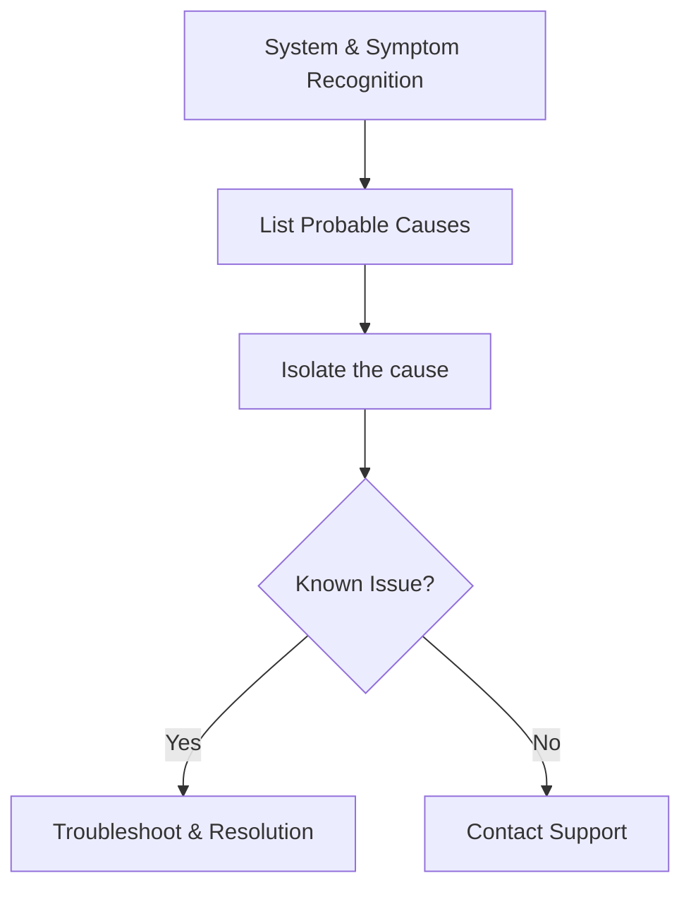

# Troubleshooting Guide

>Use this guide to troubleshoot and resolve common issues.

---

## Table of Contents
- #Overview
- #Troubleshooting_Process
- #Common_Issues
  - #Login_Failure
  - #Integration_Failure
  - #Log_Collection
- #Error_Screenshot
- #Diagnostic_Checklist
- #Escalation_Matrix
- #Contact_Support
  - #Useful_command
- #Additional_Notes

---

## Overview

This guide a structured set of instructions designed to help users identify symptoms, isolate causes, and resolve technical problems efficiently as per the policies of the company. 

---

## Troubleshooting Process



---

## Common Issues

### Login Failure

**Symptoms**

- Unable to sign in
- Authentication error

**Resolution**

1. Verify username
2. Reset password
3. Retry login

---

### Integration Failure

| Error Code | Description | Resolution |
|------------|------------|------------|
| 401 | Unauthorized | Verify credentials |
| 403 | Forbidden | Check permissions |
| 500 | Server Error | Contact Support |

---

### Log Collection

Run:

```powershell
Get-EventLog Application -Newest 50
```

---

## Error Screenshot


---

## Diagnostic Checklist

- [ ] Verify network
- [ ] Verify credentials
- [ ] Verify service status
- [ ] Check logs

---

## Escalation Matrix

| Priority | Response |
|----------|----------|
| Critical | Immediate |
| High | 4 Hours |
| Medium | 1 Business Day |
| Low | 3 Business Days |

---

## Contact Support

Email: support@example.com

### Useful Command

```bash
ping server.company.com
```

---

## Additional Notes

> Collect logs before opening a support case.
