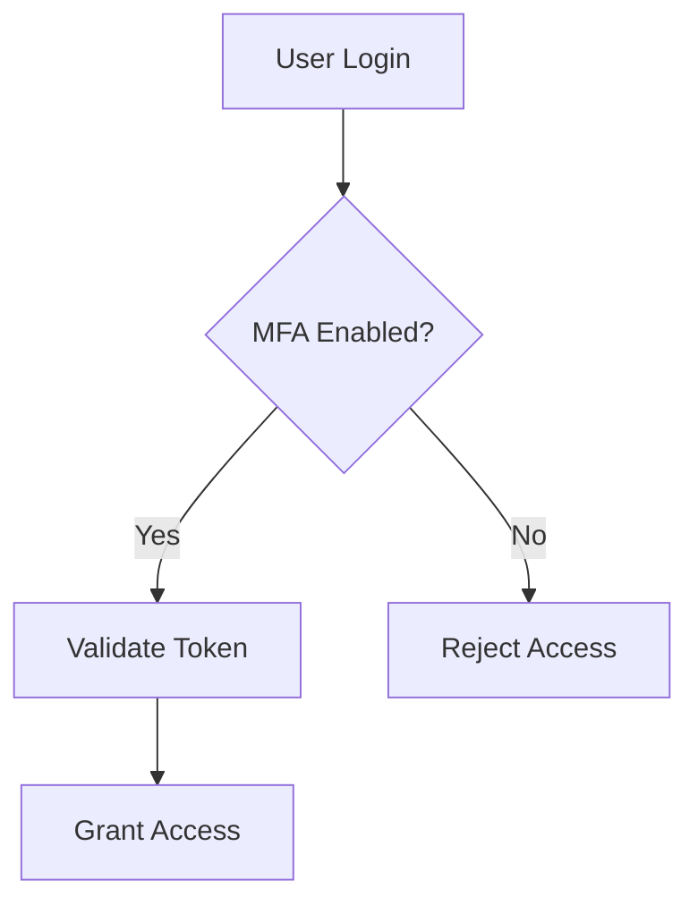

# Administration Guide

>This is a technical manual that gives system administrators instructions to install, configure, secure, and maintain the application.

## Table of Contents
- #Overview
- #Administrator_Responsibilities
  - #User_Management
  - #Security_Controls
- #Security_Workflow
- #Add_New_User
  - #Example
- #Administration_Screen
- #Audit_Recomendations
- #Task_Checklist
- #API_Configuration

---

## Overview

Administrators manage:

- Users
- Security
- Integrations
- System Configuration

---

## Administrator Responsibilities

### User Management

- Create users
- Modify permissions
- Disable inactive accounts

### Security Controls

| Area | Description |
|--------|-------------|
| MFA | Multi-factor Authentication |
| RBAC | Role Based Access Control |
| SSO | Single Sign-On |

---

## Security Workflow



---

## Add New User

1. Navigate to **Administration**
2. Select **Users**
3. Click **Add User**

### Example

```html
<input type="text" placeholder="Username">
```

---

## Administration Screen


---

## Audit Recommendations

> Review permissions quarterly.

---

## Task Checklist

- [ ] Review User Roles
- [ ] Verify MFA
- [ ] Audit Integrations

---

## API Configuration

```yaml
authentication:
type: OAuth
tokenExpiration: 60
```
