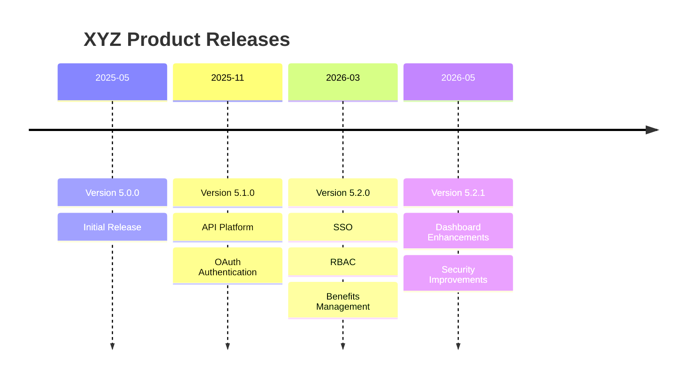

# Changelog

All notable changes to **XYZ Product** will be documented in this file.

The format is based on [Keep a Changelog](https://keepachangelog.com/en/1.1.0/).

---

## [5.2.1] - 2026-05-20

### Added

- New Dashboard experience with enhanced visual analytics.
- Employee Trend reporting widget.
- Department Distribution chart.
- Pending Approvals dashboard panel.
- Quick Action menu for frequently used tasks.
- Audit Log search and filtering capabilities.

### Changed

- Improved overall application performance.
- Updated administration workflow for user provisioning.
- Enhanced Payroll processing screens.
- Refreshed product branding and icons.

### Fixed

- Resolved intermittent login timeout issues.
- Corrected export formatting in PDF reports.
- Fixed date filter inconsistencies on dashboard reports.

### Security

- Improved Multi-Factor Authentication validation.
- Enhanced authentication token handling.

---

## [5.2.0] - 2026-03-15

### Added

- Single Sign-On (SSO) integration.
- Role-Based Access Control (RBAC).
- New Benefits Administration module.
- Employee self-service profile updates.

### Changed

- Redesigned employee search functionality.
- Improved navigation menu responsiveness.
- Enhanced report generation performance.

### Fixed

- Fixed payroll calculation rounding issues.
- Resolved duplicate employee record validation error.

### Deprecated

- Legacy User Management screen.
- Legacy Reporting Dashboard.

---

## [5.1.0] - 2025-11-10

### Added

- REST API support for employee management.
- API authentication using OAuth 2.0.
- System Health monitoring dashboard.
- Email notification framework.

### Changed

- Improved API response times.
- Updated reporting engine.

### Fixed

- Corrected payroll tax calculation edge cases.
- Fixed user preference persistence issues.

---

## [5.0.0] - 2025-05-20

### Added

- Initial release of XYZ Product.
- Employee Management.
- Payroll Processing.
- Reporting & Analytics.
- Time and Attendance Management.
- Security Administration.
- Audit Logging.
- Dashboard Home Page.

### Known Limitations

- Mobile device optimization is limited.
- CSV imports support up to 50,000 records.

---

## Upgrade Notes

### Upgrading from 5.1.x to 5.2.x

#### Database

No database schema update required.

#### Configuration

Review the following settings:

```yaml
dashboard:
enableAnalytics: true
enableQuickActions: true
```

#### Validation

Verify:

- User authentication
- Dashboard widgets
- Payroll processing
- Report generation

---

## Support Matrix

| Version | Support Status |
|----------|----------------|
| 5.2.x | ✅ Current Release |
| 5.1.x | ✅ Supported |
| 5.0.x | ⚠️ Limited Support |
| 4.x | ❌ End of Support |

---

## Legend

| Symbol | Meaning |
|---------|---------|
| ✅ | Supported |
| ⚠️ | Limited Support |
| ❌ | Unsupported |
| 🔒 | Security Changes |
| 🚀 | New Features |
| 🛠 | Fixes |

---

## Version History Summary



---

**Documentation References**

| Guide | Link |
|--------|------|
| Installation Guide | ./guides/InstallationGuide.md |
| Getting Started Guide | ./guides/GettingStartedGuide.md |
| Administration Guide | ./guides/AdministrationGuide.md |
| User Guide | ./guides/UserGuide.md |
| Troubleshooting Guide | ./guides/TroubleshootingGuide.md |

---

© 2026 XYZ Product Documentation Team

Typical Repository Structure
docs/

├── README.md
├── CHANGELOG.md
│
├── guides/
│ ├── InstallationGuide.md
│ ├── GettingStartedGuide.md
│ ├── AdministrationGuide.md
│ ├── UserGuide.md
│ └── TroubleshootingGuide.md
│
├── images/
│ ├── installation-wizard.png
│ ├── dashboard.png
│ ├── admin-console.png
│ └── error-screen.png
│
└── api/
├── openapi.yaml
└── release-notes.md
``
