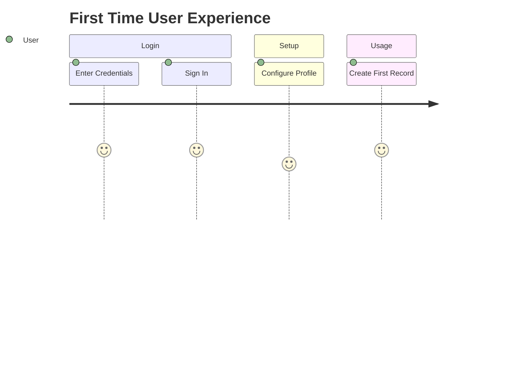

# Getting Started Guide

> Welcome to Product XYZ.

## Open the Home Page

Enter the URL:

```text
https://XYZCompany.com
```
The Home Page opens up. Click `Login`.
>

### Sample Login Screen


---

## User Journey



---

## Quick Start Tasks

1. Sign in
2. Configure Profile
3. Create Employee
4. Run Report

---

## Keyboard Shortcuts

| Action | Shortcut |
|----------|----------|
| Save | Ctrl+S |
| Search | Ctrl+F |
| Refresh | F5 |

---

## Important

> Always use your corporate credentials.

### Helpful Links

- [Documentatione.com/docs
- [Support Center.com/support

---

## Example Configuration

```json
{
"environment": "Production",
"featureEnabled": true
}
```
