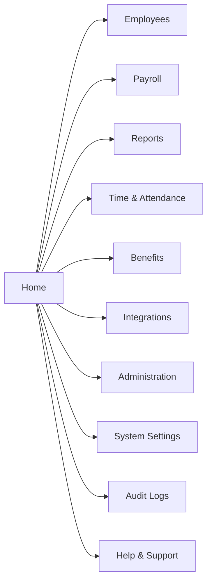

# User Guide

>This guide helps end users perform common tasks.

---

## Table of Contents

- #Introduction
- #Dashboard_Overview
  - #Main_Areas
- #Navigation_Diagram
- #Creating_a_New_Employee_Record
  - #Example_Data
- #Search_Tips
- #Best_Practises
  - #Recommended
  - #Not_Recommended
- #Frequently_Used_Features 
---
## Introduction

This user guide is a concise, task-oriented document that provides step-by-step instructions to help end users operate this product, software, or service efficiently on a day to day basis.

---

## Dashboard Overview


### Main Areas

| Area | Description |
|--------|-------------|
| Home | Landing Page |
| Reports | Analytics |
| Profile | User Settings |

---

## Navigation Diagram



---

## Creating a new Employee Record

1. Click **Employees**.
2. Click **New Record**.
3. Enter employee details.
4. Click **Save**.

### Example Data

```json
{
"employeeId": 1001,
"firstName": "John",
"lastName": "Smith",
"dateOfBirth": "08/16/2000",
"department": "Admin",
"hireDate": "08/17/2026",
"payPeriod": "Weekly"
}
```

---

## Search Tips

Use:

`Employee ID`

or

`Employee Name`

---

## Best Practices

> Save work frequently.

### Recommended

- Verify data before saving
- Review reports monthly

### Not Recommended

- ~~Sharing credentials~~
- ~~Using generic accounts~~

---

## Frequently Used Features

| Feature | Benefit |
|-----------|---------|
| Search | Faster access |
| Favorites | Quick navigation |
| Export | Data sharing |